# 9.2 this 指针
## 1. C++使用`ECX`向成员函数传递对象首地址：

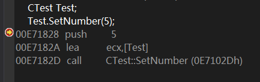

图1：（显示符号名）

----------

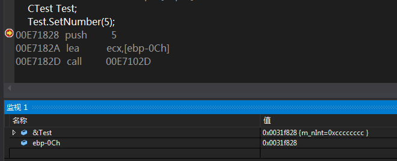

图2：（不显示符号名）

## 2. 访问成员变量的方式

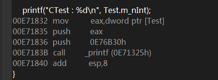

图3：（显示符号名）

----------

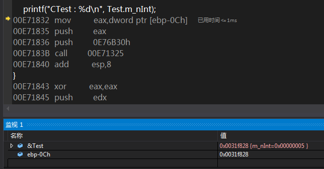

图4：（不显示符号名）

**结合`CTest`对象的内存布局可知，对象首地址处4字节的内容即为`m_nInt`**

## 2. `CTest::SetNumber` 函数分析：

**调用`SetNumber`时，`call`指令后接了一个`jmp`，然后才转到函数的具体实现，不明白这样设计的缘由：**

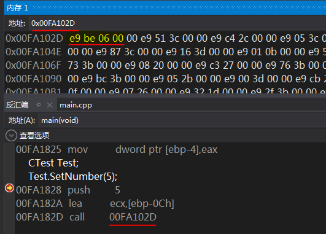

图5

----------

**关键代码片段：**

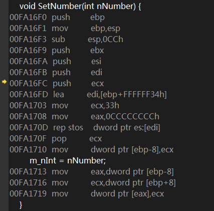

图6：（不显示符号名）

----------

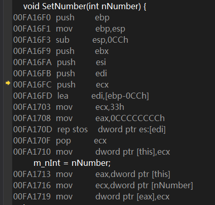

图7：（显示符号名）

**显然，`ecx`中的对象首地址先是被放进`eax`，通过`eax`对成员变量`m_nInt`进行寻址.**

**结合以上分析可知，在VS环境下，C++中的成员函数（非静态成员函数）都有一个隐藏参数，即对象自身的指针，使用`ecx`进行传递.**

## 2. `__stdcall`的成员函数调用：
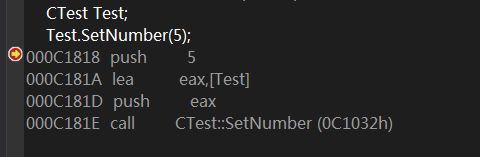

图8：对象首址的传递

**可见，`__stdcall`调用方式下，成员函数不再使用`ecx`传递对象首地址，而是使用栈传递，且对象首址是成员函数的第一个参数.**

**`__stdcall SetNumber`的关键代码：**

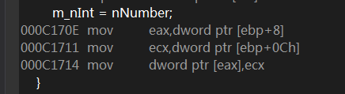

图9

**其中，`[ebp+8]`即为函数的第一个参数，即对象首地址.**

# 9.3 静态数据成员
## 1. 静态数据成员不参与对象的长度计算：
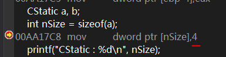

图10

## 2. 静态数据成员的地址问题
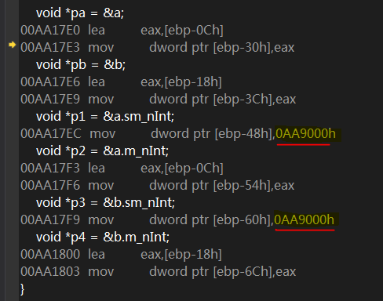

图11

**通过反汇编可知：普通数据成员`m_nInt`在栈里分配内存，而静态数据成员`sm_nInt`的地址为`0AA9000h`，显然不是栈地址; 同一个类的不同对象的静态数据成员地址相同，在内存中只有一份; 在使用过程中，静态数据成员通过常量地址访问，可通过主存直接寻址的方式访问**

**使用PEView查看执行文件的.data段，可以看到`sm_nInt`的初始化值：**

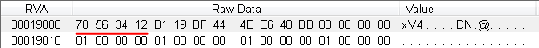

图12

## 3. 静态成员函数
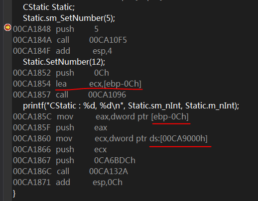

图13

**静态成员函数不再传递对象首地址！！正是因此，静态成员函数内不允许访问非静态成员--连对象首址都不知道，又如何访问？但是非静态成员函数却可以访问静态数据成员--访问静态数据成员的方式是“主存直接寻址”，并不需要知道对象首址.**

# 9.4 对象作为函数参数
## 1. 对象作为函数的参数
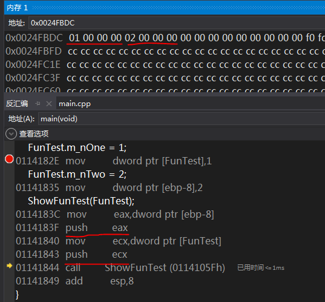

图14

**`CFunTest`类定义了两个int成员变量`m_nOne`和`m_nTwo`，当对象作为参数被传递给`ShowFunTest`时，`m_nTwo`和`m_nOne`被依次压栈--成员变量的压栈顺序与类里的定义顺序相反. 本例中并没有将对象首地址传递给函数.**

## 2. 含有数组数据成员的对象传参
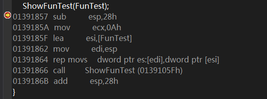

图15

**本例的传参方式依然是通过栈--将对象在内存中的内容全部拷贝到申请的栈空间. `FunTest`对象有2个int和一个32B的char数组，大小为40B(0x28)，`sub esp,28h`就是在栈空间申请这么多字节，然后执行内存拷贝，函数调用结束后`add esp,28h`平衡栈. 同样地，本例依然没有传递对象首址，但与上一个例子有一个共同之处--对象作为参数在传递过程中会在栈空间制作一份对象的数据副本.**

**反思：以前学习C++时，都说“如果没有定义构造函数，编译器会添加一个默认的不带参数的构造函数”，现在看来该说法存在争议，因为到目前为止的分析中并未看到调用“默认构造函数”的痕迹.**

## 3. 对象作为参数的资源释放错误
**本例定义了`CMyString`的构造函数，因此可以看到一些从前没有的代码：**

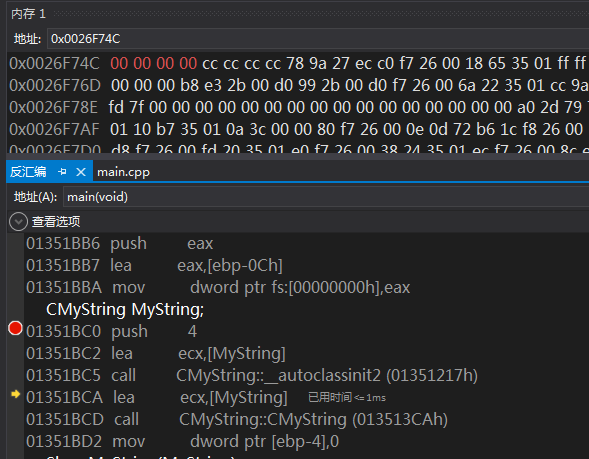

图16

**`CMyString::__autoclassinit2`对`MyString`对象完成初始化，跟踪发现，其内部调用`_memset`将对象占据的栈空间内存清零，前面的`push 4`便是传递给`CMyString::__autoclassinit2`的第二个参数--对象的大小(sizeof(char\*)=4；同样，对象首地址通过`ecx`传递.**

----------

**一条奇怪的指令：**

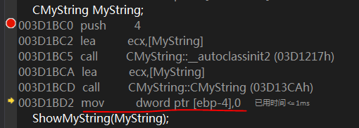

图17

**构造函数调用完毕后，将`ebp-4`指向的4字节内存赋值为0. 书中解释：记录同一作用域内该类的对象个数，详见第10章**

**下面分析`ShowMyString`:**

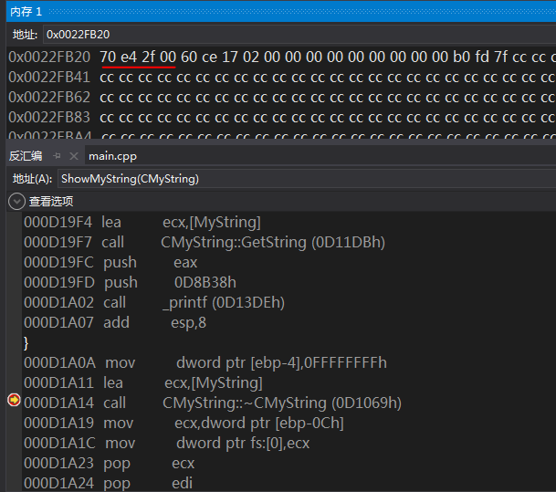

图18

**反汇编显示，`ShowMyString`调用结尾处，便会释放参数对象`MyString`. 注意到函数作用域内的对象只是实参对象的副本，记为`MyStringCpy`，但实参`MyString`和`MyStringCpy`的成员`m_pString`均指向堆空间同一位置(new操作符内部最终调用`_malloc`在进程堆上分配内存)，记下这个地址:`002fe407h`.**

**在main结尾处，再次调用析构，并释放main函数作用域内的对象`MyString`, 其数据成员`m_pString`仍指向`002fe407h`:**

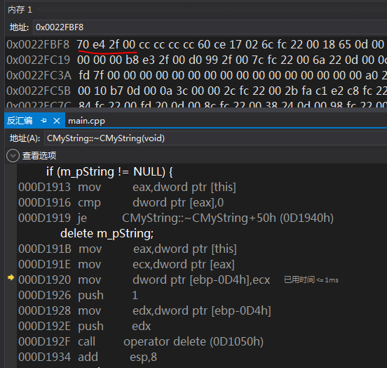

图19

**不妨查看该处的内存, 显然已被释放**

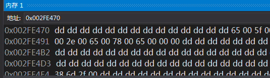

图20

**本例中，对象`MyString`和对象副本`MyStringCpy`的数据成员`m_pString`指向堆空间同一地址，因此重复调用`_free`进行释放将导致错误.**

**类似地，下面代码也将引发异常：**

```
void main() {
	CMyString MyString;
	ShowMyString(MyString);
	ShowMyString(MyString);
}
```

**第一个`ShowMyString`调用结束后，`MyString`中的数据成员`m_pString`所保存的堆空间已经被释放掉，再次使用此对象的数据成员`m_pString`便无法得到预期的数据；另外，再次调用`ShowMyString`将发生重复释放堆空间内存的异常.**

## 4. 对象指针作为参数
**当对象指针作为函数参数时，不再在栈空间制作对象副本，而是直接传递对象首地址：**

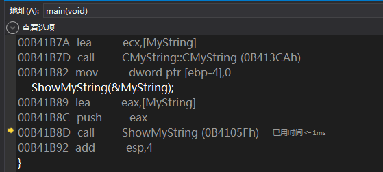

图21

**此时，`ShowMyString`调用结尾处不再释放对象内存：**

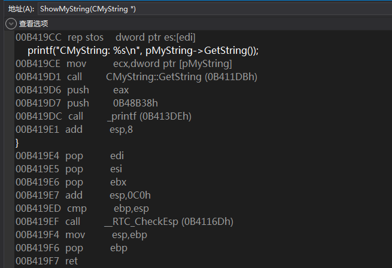

图22

**对象`MyString`的释放和析构仅出现在main函数结尾处：**

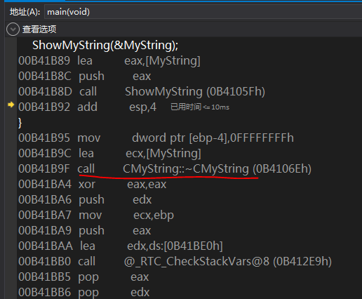

图23

## 5. 对象引用作为参数
**当对象引用作为函数参数时，与对象指针的处理方式一样，直接传递对象首地址：**

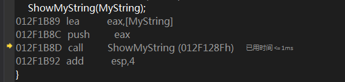

图24

**至于对象的释放与析构，仍与对象指针的处理方式一样.**

----------

**经过前面的分析可知，如果给函数传递的参数是对象指针或引用，在函数内的操作都是针对原对象的，不存在对象被复制的问题。 由于没有副本，因此在函数退出时不会释放和析构对象，也就不存在资源释放的错误隐患。 在使用类对象作为参数时，如无特殊需求，应尽量使用指针或引用（反汇编分析显示，指针和引用在汇编层次是没有区别的!!!）. 这样做不但可以避免资源释放的错误隐患，还可在函数调用过程中避免复制对象的过程，提升程序的运行效率。**

# 9.5 对象作为返回值
## 1. 对象直接作为返回值
**对象直接作为返回值时，调用者首先在栈空间申请内存M1，将M1的地址传递给被调函数，被调函数将对象拷贝到M1：**

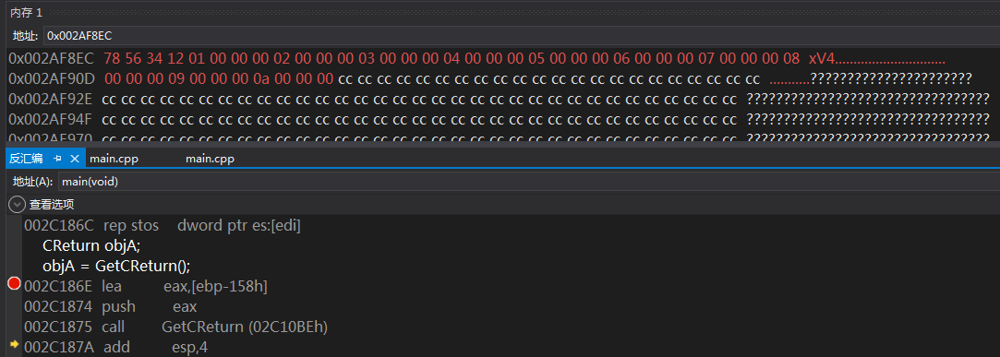

图25

**然后，调用者将M1中的对象数据拷贝到栈空间M2，最后将M2中的对象数据拷贝到对象`ojbA`所在的栈空间内存，至此才完成返回对象操作: **

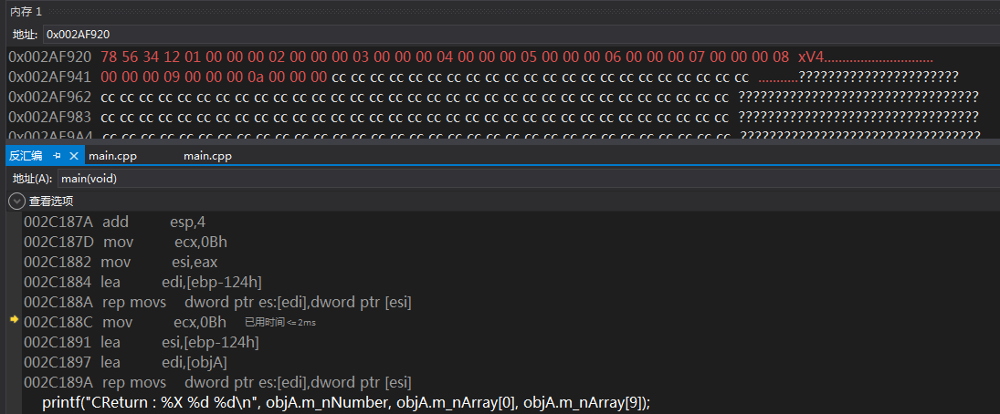

图26

**针对上述过程，我的疑问是：为什么调用者要在栈空间申请内存M2，而不是直接将返回对象从M1拷贝到目标对象`objA`中? 书中解释，M1用于存放被调函数的返回值对象，M2用于存放临时对象. 为什么要使用这个临时对象呢？因为调用返回对象的函数时，可以采用这类写法:`GetCReturn().m_nNumber`，这只是针对返回对象的操作，而此时返回对象已经退出，其栈帧已被关闭。函数返回后去操作局部对象显然不合适，因此只能由调用者准备空间，建立临时对象，然后将函数中的局部对象拷贝给临时对象，再把这个临时对象交给调用者去操作。 例如：**

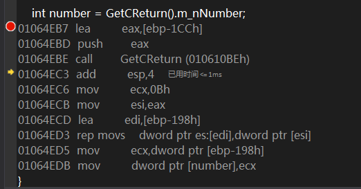

图27

**可以看到，访问`m_nNumber`时便是针对位于M1内存空间的临时对象的操作.**

**现在，分析`GetCReturn`是如何返回对象的：**

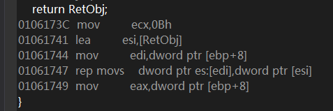

图28

**图28 即关键代码，其中`ebp+8`正是调用者传递进去的M1内存地址.**

# 尾声
- 在VS编译环境下，使用`ecx`传递类对象的首地址，但并非具有`ecx`传参的函数就一定是成员函数，当使用`__fastcall`时，同样可以在反汇编代码中体现出`ecx`传参：

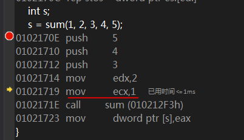

图29

- ...