# 10.1 构造函数的出现时机
## 1. 局部对象
**在进入对象作用域（此处为main函数的栈帧）时，编译器会产生调用构造函数的代码. 由于构造函数属于成员函数，因此在调用过程中同样需要传递对象首地址(图1):**

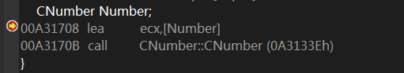

图1

**构造函数调用结束后，会将this指针作为返回值. 返回this指针便是构造函数的特征之一. 下面证实该说法:**

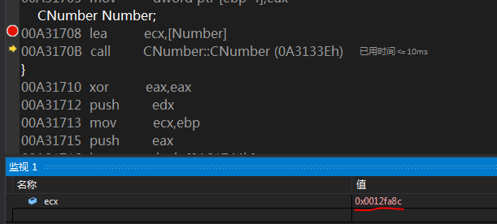

图2

**在调用构造函数前，先记下`ecx`保存的对象首地址(图2)；再跟踪构造函数(图3)：**

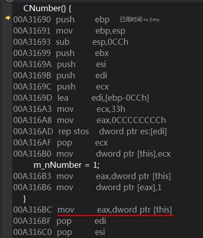

图3

**构造函数结尾处将this指针放进了`eax`，从而将其返回给调用者.**

**结合上述分析，可以总结识别局部对象构造函数的必要条件（不是充分条件）：**

- 该成员函数是这个对象在作用域内调用的第一个成员函数，根据this指针即可以区分每个对象；
- 该成员函数返回this指针.

**构造函数必然满足上述两个条件. 但为什们构造函数要返回this指针？**

## 2. 堆对象
**反汇编分析：**

```
pNumber = new CNumber;
00E45274  push        4  								; 传入类的大小，用于堆内存申请
00E45276  call        operator new (0E412A8h)  
00E4527B  add         esp,4  
00E4527E  mov         dword ptr [ebp-0ECh],eax			; 使用临时变量[ebp-0ECh]保存 new 返回值  
00E45284  mov         dword ptr [ebp-4],0				; [ebp-4]保存申请堆内存的次数  
00E4528B  cmp         dword ptr [ebp-0ECh],0  			; 检查堆内存是否申请成功
00E45292  je          main+77h (0E452A7h)  				; 失败则跳过构造函数
00E45294  mov         ecx,dword ptr [ebp-0ECh]  			; 成功则将对象首址传入ecx
00E4529A  call        CNumber::CNumber (0E413DEh)  		; 调用构造函数
00E4529F  mov         dword ptr [ebp-0F4h],eax  			; 构造函数返回this指针，保存到临时变量[ebp-0F4h]中
00E452A5  jmp         main+81h (0E452B1h)  
00E452A7  mov         dword ptr [ebp-0F4h],0  			; new 申请堆内存失败，设置指针为NULL
; 对象首址在几个临时变量间倒换，最终保存到 pNumber 中
00E452B1  mov         eax,dword ptr [ebp-0F4h]  
00E452B7  mov         dword ptr [ebp-0E0h],eax  
00E452BD  mov         dword ptr [ebp-4],0FFFFFFFFh  
00E452C4  mov         ecx,dword ptr [ebp-0E0h]  
00E452CA  mov         dword ptr [pNumber],ecx  
```

**现在需要验证一个问题：传入构造函数的对象地址指向堆空间，它和构造函数返回的对象地址是否相等？ 我猜测是相等的，检验后确实如此.**

**关于堆对象：在使用`new`申请堆内存以后，需要调用构造函数；如果堆内存申请失败，就会避开构造函数的调用.**

## 3. 参数对象
**重点关注`ShowMyString`的调用细节：**

```
ShowMyString(MyString);
01341CB6  sub         esp,2Ch  							; 申请参数对象的内存空间
01341CB9  mov         ecx,esp  							; 将参数对象首址传入ecx
01341CBB  mov         dword ptr [ebp-10Ch],esp  			; 将参数对象首址保存到[ebp-10Ch]
01341CC1  lea         eax,[MyString]  
01341CC4  push        eax
; 传入对象 MyString 首址(注：这里是在给拷贝构造函数传参，而不是给后面的 ShowMyString 传参!! 即，拷贝构造函数接收两个参数：参数对象地址--通过ecx传递 & 被拷贝对象 MyString 的地址--通过栈传递)
01341CC5  call        CMyString::CMyString (0134127Bh)  ; 调用拷贝构造函数
01341CCA  mov         dword ptr [ebp-114h],eax  			; 保存拷贝构造函数返回的this指针
01341CD0  call        ShowMyString (01341181h)  
01341CD5  add         esp,2Ch							; 关闭栈帧，释放参数对象
```

**现在分析：(1)在栈空间申请的参数对象的内存是如何被使用的？(2)`ShowMyString`的参数究竟是如何传递的？**

### (1)在栈空间申请的参数对象的内存是如何被使用的？
**首先在拷贝构造函数处停下，在内存窗体输入参数对象地址ecx，F10执行拷贝构造函数后可以发现参数对象的内存发送变化(图5):**

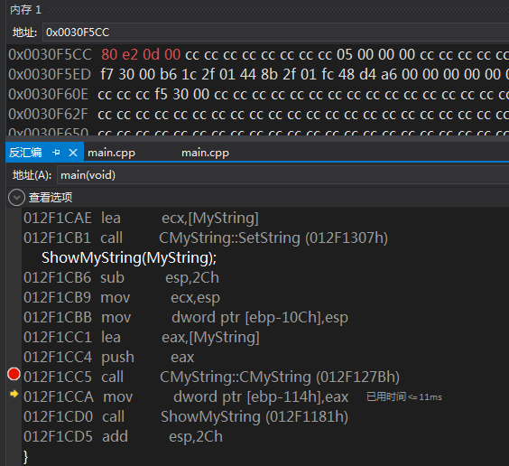

图5

----------


**现在重新分析拷贝构造函数：**

**拷贝构造函数内依然将来自ecx的对象首址传入this指针(图6)：**


图6

----------


**前面提到，“拷贝构造函数接收两个参数：参数对象地址--通过`ecx`传递 & 对象`MyString`的地址--通过栈传递”，因此分析的关键就是针对这两个参数的操作:**

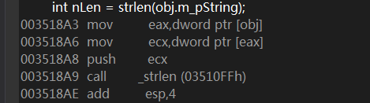

图7

**图7 展示的是针对原对象`MyString`的操作：求`MyString.m_pString`的长度.**

----------


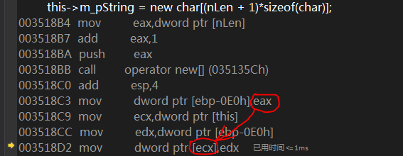

图8

**图8 展示的是，将`new`返回的堆内存地址值赋给this指针指向的参数对象的数据成员`m_pString`. 后面的字符串拷贝操作就不再分析了. 最后，拷贝构造函数返回指向参数对象的this指针.**

### (2)`ShowMyString`的参数是如何传递的？
**`ShowMyString`的参数是原对象`MyString`，还是拷贝构造函数返回的this指针指向的那个参数对象？ 我猜测是后者, 不然为何调用`ShowMyString`前要调用拷贝构造函数.**

**在之前给出的代码片段中，有一条指令`sub esp, 2Ch`，假设该指令执行后`esp`指向内存M0，结合后面的分析可知，M0为参数对象的数据，来自拷贝构造函数对`MyString`对象执行的深拷贝. 函数调用前后必须平衡栈，因此调用`ShowMyString`时`esp`指向内存M0，而拷贝构造函数返回的this指针也指向M0，那么此时`esp`与`eax`的内容是相等的(图9)：**

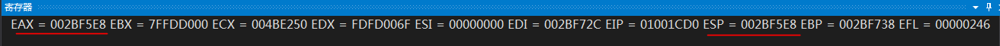

图9

**如此一来，`ShowMyString`的参数确实是如我所想的. 不过该函数的传参比较隐晦，不是常规的`push xxx`.**

**最后`ShowMyString`释放参数对象，执行析构函数. 由于使用了深拷贝，对对象中的数据成员`m_pString`所指向的堆空间资源也进行了复制，因此当参数对象被销毁时，对原对象`MyString`没有任何影响.**

## 4. 返回对象
**图10 是调用`GetMyString`的代码：**

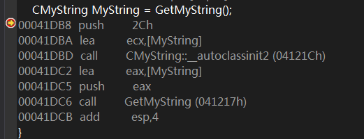

图10

**可以看到，编译器生成的代码中将对象`MyString`的地址传入了`GetMyString`，为弄清其原因，需要分析`GetMyString`(图11):**

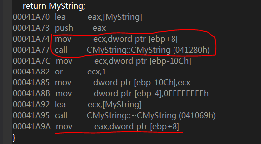

图11

**[ebp+8]即`GetMyString`的第一个也是唯一的参数--main函数作用域内的局部对象`MyString`的地址，将其传入`ecx`作为拷贝构造函数的参数--作为拷贝目标. 此外，与上一节分析的一样，拷贝构造函数还要接收一个参数--作为拷贝源的对象的地址，此处是`GetMyString`作用域内的局部对象`MyString`. 拷贝构造函数调用结束后，`GetMyString`已经完成了“返回对象”的工作，调用者已得到了他想要的：main函数局部对象`MyString`的数据成员`m_pString`被正确赋值，并指向新分配的堆空间资源，即：main函数得到了`GetMyString`的局部对象`MyString`的深拷贝.**

**最后，`GetMyString`的局部对象`MyString`被销毁，析构；并将其参数--main函数作用域内的局部对象`MyString`的地址--传入`eax`，返回给调用者.**

**main函数最后，销毁并析构其局部对象`MyString`(图12):**

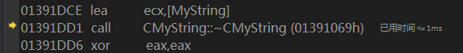

图12

**由于main函数内销毁的对象是`GetMyString`的局部对象的深拷贝，因此不会发生资源释放错误.**

**现在回顾`GetMyString`，反汇编显示，`GetMyString`将返回对象的地址作为参数；在函数返回前，利用拷贝构造函数将函数中局部对象的数据复制到参数指向的对象中，起到了“返回对象”的作用. 与其等价的含糊原型如下所示：**

`CMyString* GetMyString(CMyString* pMyString);`

**那么不妨定义一个这样的函数（命名为`GetMyString2`），观察其调用细节：**

**main函数内的调用代码与`GetMyString`一样(图13):**

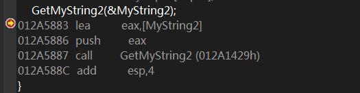

图13

**而`GetMyString2`内，不再调用以参数为拷贝目标的拷贝构造函数，而是直接将参数传入`eax`作为返回值, 如下所示:**

```
	pMyString = &MyString;
012A1A66  lea         eax,[MyString]  
012A1A69  mov         dword ptr [pMyString],eax  
	return pMyString;
012A1A6C  mov         eax,dword ptr [pMyString]  
012A1A6F  mov         dword ptr [ebp-10Ch],eax  
012A1A75  mov         dword ptr [ebp-4],0FFFFFFFFh  
012A1A7C  lea         ecx,[MyString]  
012A1A7F  call        CMyString::~CMyString (012A1069h)  
012A1A84  mov         eax,dword ptr [ebp-10Ch]  
```

**如上代码所示，在使用指针作为参数和返回值时，函数内没有对拷贝构造函数的调用。以此为依据，便可区分参数或返回值是对象还是对象指针。**
