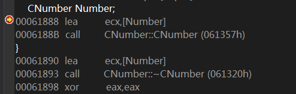
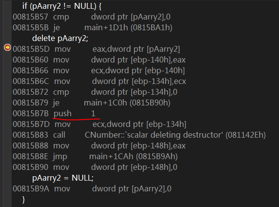
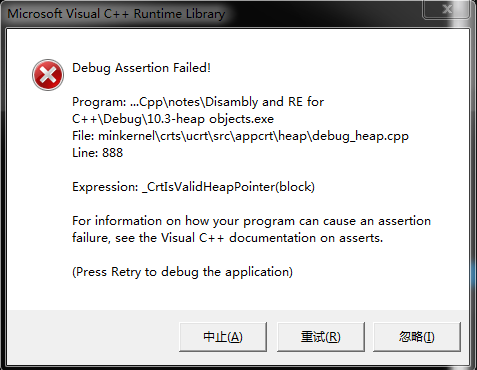

# 10.1 构造函数的出现时机
## 1. 局部对象
**在进入对象作用域（此处为main函数的栈帧）时，编译器会产生调用构造函数的代码. 由于构造函数属于成员函数，因此在调用过程中同样需要传递对象首地址(图1):**


图1

**构造函数调用结束后，会将this指针作为返回值. 返回this指针便是构造函数的特征之一. 下面证实该说法:**


图2

**在调用构造函数前，先记下`ecx`保存的对象首地址(图2)；再跟踪构造函数(图3)：**


图3

**构造函数结尾处将this指针放进了`eax`，从而将其返回给调用者.**

**结合上述分析，可以总结识别局部对象构造函数的必要条件（不是充分条件）：**

- 该成员函数是这个对象在作用域内调用的第一个成员函数，根据this指针即可以区分每个对象；
- 该成员函数返回this指针.

**构造函数必然满足上述两个条件. 但为什们构造函数要返回this指针？**

## 2. 堆对象
**反汇编分析：**

```
pNumber = new CNumber;
00E45274  push        4  					; 传入类的大小，用于堆内存申请
00E45276  call        operator new (0E412A8h)  
00E4527B  add         esp,4  
00E4527E  mov         dword ptr [ebp-0ECh],eax			; 使用临时变量[ebp-0ECh]保存 new 返回值  
00E45284  mov         dword ptr [ebp-4],0			; [ebp-4]保存申请堆内存的次数  
00E4528B  cmp         dword ptr [ebp-0ECh],0  			; 检查堆内存是否申请成功
00E45292  je          main+77h (0E452A7h)  			; 失败则跳过构造函数
00E45294  mov         ecx,dword ptr [ebp-0ECh]  		; 成功则将对象首址传入ecx
00E4529A  call        CNumber::CNumber (0E413DEh)  		; 调用构造函数
00E4529F  mov         dword ptr [ebp-0F4h],eax  		; 构造函数返回this指针，保存到临时变量[ebp-0F4h]中
00E452A5  jmp         main+81h (0E452B1h)  
00E452A7  mov         dword ptr [ebp-0F4h],0  			; new 申请堆内存失败，设置指针为NULL
; 对象首址在几个临时变量间倒换，最终保存到 pNumber 中
00E452B1  mov         eax,dword ptr [ebp-0F4h]  
00E452B7  mov         dword ptr [ebp-0E0h],eax  
00E452BD  mov         dword ptr [ebp-4],0FFFFFFFFh  
00E452C4  mov         ecx,dword ptr [ebp-0E0h]  
00E452CA  mov         dword ptr [pNumber],ecx  
```

**现在需要验证一个问题：传入构造函数的对象地址指向堆空间，它和构造函数返回的对象地址是否相等？ 我猜测是相等的，检验后确实如此.**

**关于堆对象：在使用`new`申请堆内存以后，需要调用构造函数；如果堆内存申请失败，就会避开构造函数的调用.**

## 3. 参数对象
**重点关注`ShowMyString`的调用细节：**

```
ShowMyString(MyString);
01341CB6  sub         esp,2Ch  						; 申请参数对象的内存空间
01341CB9  mov         ecx,esp  						; 将参数对象首址传入ecx
01341CBB  mov         dword ptr [ebp-10Ch],esp  			; 将参数对象首址保存到[ebp-10Ch]
01341CC1  lea         eax,[MyString]  
01341CC4  push        eax
; 传入对象 MyString 首址(注：这里是在给拷贝构造函数传参，而不是给后面的 ShowMyString 传参!! 即，拷贝构造函数接收两个参数：参数对象地址--通过ecx传递 & 被拷贝对象 MyString 的地址--通过栈传递)
01341CC5  call        CMyString::CMyString (0134127Bh)  		; 调用拷贝构造函数
01341CCA  mov         dword ptr [ebp-114h],eax  			; 保存拷贝构造函数返回的this指针
01341CD0  call        ShowMyString (01341181h)  
01341CD5  add         esp,2Ch						; 关闭栈帧，释放参数对象
```

**现在分析：(1)在栈空间申请的参数对象的内存是如何被使用的？(2)`ShowMyString`的参数究竟是如何传递的？**

### (1)在栈空间申请的参数对象的内存是如何被使用的？
**首先在拷贝构造函数处停下，在内存窗体输入参数对象地址ecx，F10执行拷贝构造函数后可以发现参数对象的内存发送变化(图5):**


图5

----------


**现在重新分析拷贝构造函数：**

**拷贝构造函数内依然将来自ecx的对象首址传入this指针(图6)：**


图6

----------


**前面提到，“拷贝构造函数接收两个参数：参数对象地址--通过`ecx`传递 & 对象`MyString`的地址--通过栈传递”，因此分析的关键就是针对这两个参数的操作:**


图7

**图7 展示的是针对原对象`MyString`的操作：求`MyString.m_pString`的长度.**

----------


图8

**图8 展示的是，将`new`返回的堆内存地址值赋给this指针指向的参数对象的数据成员`m_pString`. 后面的字符串拷贝操作就不再分析了. 最后，拷贝构造函数返回指向参数对象的this指针.**

### (2)`ShowMyString`的参数是如何传递的？
**`ShowMyString`的参数是原对象`MyString`，还是拷贝构造函数返回的this指针指向的那个参数对象？ 我猜测是后者, 不然为何调用`ShowMyString`前要调用拷贝构造函数.**

**在之前给出的代码片段中，有一条指令`sub esp, 2Ch`，假设该指令执行后`esp`指向内存M0，结合后面的分析可知，M0为参数对象的数据，来自拷贝构造函数对`MyString`对象执行的深拷贝. 函数调用前后必须平衡栈，因此调用`ShowMyString`时`esp`指向内存M0，而拷贝构造函数返回的this指针也指向M0，那么此时`esp`与`eax`的内容是相等的(图9)：**


图9

**如此一来，`ShowMyString`的参数确实是如我所想的. 不过该函数的传参比较隐晦，不是常规的`push xxx`.**

**最后`ShowMyString`释放参数对象，执行析构函数. 由于使用了深拷贝，对对象中的数据成员`m_pString`所指向的堆空间资源也进行了复制，因此当参数对象被销毁时，对原对象`MyString`没有任何影响.**

## 4. 返回对象
**图10 是调用`GetMyString`的代码：**


图10

**可以看到，编译器生成的代码中将对象`MyString`的地址传入了`GetMyString`，为弄清其原因，需要分析`GetMyString`(图11):**


图11

**[ebp+8]即`GetMyString`的第一个也是唯一的参数--main函数作用域内的局部对象`MyString`的地址，将其传入`ecx`作为拷贝构造函数的参数--作为拷贝目标. 此外，与上一节分析的一样，拷贝构造函数还要接收一个参数--作为拷贝源的对象的地址，此处是`GetMyString`作用域内的局部对象`MyString`. 拷贝构造函数调用结束后，`GetMyString`已经完成了“返回对象”的工作，调用者已得到了他想要的：main函数局部对象`MyString`的数据成员`m_pString`被正确赋值，并指向新分配的堆空间资源，即：main函数得到了`GetMyString`的局部对象`MyString`的深拷贝.**

**最后，`GetMyString`的局部对象`MyString`被销毁，析构；并将其参数--main函数作用域内的局部对象`MyString`的地址--传入`eax`，返回给调用者.**

**main函数最后，销毁并析构其局部对象`MyString`(图12):**


图12

**由于main函数内销毁的对象是`GetMyString`的局部对象的深拷贝，因此不会发生资源释放错误.**

**现在回顾`GetMyString`，反汇编显示，`GetMyString`将返回对象的地址作为参数；在函数返回前，利用拷贝构造函数将函数中局部对象的数据复制到参数指向的对象中，起到了“返回对象”的作用. 与其等价的含糊原型如下所示：**

`CMyString* GetMyString(CMyString* pMyString);`

**那么不妨定义一个这样的函数（命名为`GetMyString2`），观察其调用细节：**

**main函数内的调用代码与`GetMyString`一样(图13):**


图13

**而`GetMyString2`内，不再调用以参数为拷贝目标的拷贝构造函数，而是直接将参数传入`eax`作为返回值, 如下所示:**

```
	pMyString = &MyString;
012A1A66  lea         eax,[MyString]  
012A1A69  mov         dword ptr [pMyString],eax  
	return pMyString;
012A1A6C  mov         eax,dword ptr [pMyString]  
012A1A6F  mov         dword ptr [ebp-10Ch],eax  
012A1A75  mov         dword ptr [ebp-4],0FFFFFFFFh  
012A1A7C  lea         ecx,[MyString]  
012A1A7F  call        CMyString::~CMyString (012A1069h)  
012A1A84  mov         eax,dword ptr [ebp-10Ch]  
```

**如上代码所示，在使用指针作为参数和返回值时，函数内没有对拷贝构造函数的调用。以此为依据，便可区分参数或返回值是对象还是对象指针。**

# 10.3 析构函数的出现时机
## 1. 局部对象
**对象`Number`在其局部作用域结束处，调用析构函数。析构函数属于成员函数，因此在调用过程中也需要通过`ecx`传递对象首地址:**



图14

**与构造函数不同，析构函数无需也不会返回对象首址.**

## 2. 堆对象
**堆对象的销毁需要程序员使用`delete`触发，如其他堆数据一样.**

```
	if (pNumber != NULL) {
00F91AD9  cmp         dword ptr [pNumber],0  
00F91ADD  je          main+103h (0F91B23h)  		; 用户使用的指针检查
		delete pNumber;
00F91ADF  mov         eax,dword ptr [pNumber]  
00F91AE2  mov         dword ptr [ebp-104h],eax  
00F91AE8  mov         ecx,dword ptr [ebp-104h]  
00F91AEE  mov         dword ptr [ebp-0F8h],ecx  
00F91AF4  cmp         dword ptr [ebp-0F8h],0		; 编译器的指针检查
00F91AFB  je          main+0F2h (0F91B12h)  
00F91AFD  push        1
; 传递释放对象类型标志，1为释放单个对象，3为释放对象数组，0表示仅执行析构函数
00F91AFF  mov         ecx,dword ptr [ebp-0F8h]  ; 传递this指针
; 调用析构代理函数
00F91B05  call        CNumber::`scalar deleting destructor' (0F911A4h)
00F91B0A  mov         dword ptr [ebp-10Ch],eax  
00F91B10  jmp         main+0FCh (0F91B1Ch)		; 释放空间成功，跳过失败处理  
00F91B12  mov         dword ptr [ebp-10Ch],0  
		pNumber = NULL;
00F91B1C  mov         dword ptr [pNumber],0  
	}
```

**析构代理函数的实现分析(关键代码)：**

```
CNumber::`scalar deleting destructor':
···
00F91910  mov         dword ptr [this],ecx  
00F91913  mov         ecx,dword ptr [this]  
00F91916  call        CNumber::~CNumber (0F913BBh)	; 调用析构函数 
00F9191B  mov         eax,dword ptr [ebp+8]  
00F9191E  and         eax,1				; 检查析构函数标记
00F91921  je          CNumber::`scalar deleting destructor'+41h (0F91931h)  
00F91923  push        4					; 堆内存大小
00F91925  mov         eax,dword ptr [this]  
00F91928  push        eax				; 堆内存地址
00F91929  call        operator delete (0F91050h)	; 释放堆空间
00F9192E  add         esp,8  
00F91931  mov         eax,dword ptr [this]		; 返回堆对象地址
```

**在释放堆对象的过程中，使用了析构代理函数间接调用析构函数和`delete`算符. 不直接调用析构函数的`delete`算符的原因之一是，在某些情况下，需要释放的对象不止一个，如果直接调用析构函数，则无法释放多个对象. 下面用一个实例说明该问题:**

```
CNumber *pArray = new CNumber[2];
; 两个对象总大小为 58h 字节，多出的 4 字节数据是为何
; 在申请堆数组时，会使用堆内存的开头 4 字节保存对象总个数
00141B4D  push        5Ch  
00141B4F  call        operator new[] (014135Ch)  
00141B54  add         esp,4  
00141B57  mov         dword ptr [ebp-0ECh],eax		; 保存`new`返回的堆地址  
00141B5D  mov         dword ptr [ebp-4],0  
00141B64  cmp         dword ptr [ebp-0ECh],0		; 检查堆地址
00141B6B  je          main+97h (0141BA7h)  
00141B6D  mov         eax,dword ptr [ebp-0ECh]  
00141B73  mov         dword ptr [eax],2			; 将对象总个数保存在堆内存开头 4 字节
; 下面压入了两个地址，在反汇编窗口输入这两个地址，查看显示，分别是析构函数和构造函数的入口地址
00141B79  push        1413E3h				; arg5-析构函数地址  
00141B7E  push        141424h				; arg4-构造函数地址
00141B83  push        2					; arg3-对象个数
00141B85  push        2Ch				; arg2-每个对象的大小
00141B87  mov         ecx,dword ptr [ebp-0ECh]		; `new`返回的堆地址传入`ecx`
00141B8D  add         ecx,4				; 跳过保存对象总个数的 4 字节后，`ecx`指向第一个堆对象
00141B90  push        ecx				; arg1-数组中第一个对象的地址
; 调用构造代理函数  
00141B91  call        `eh vector constructor iterator' (0141131h)  
00141B96  mov         edx,dword ptr [ebp-0ECh]  
00141B9C  add         edx,4				; `edx`指向第一个堆对象  
00141B9F  mov         dword ptr [ebp-10Ch],edx		; 保存第一个堆对象的地址
00141BA5  jmp         main+0A1h (0141BB1h)		; 跳过申请堆内存的失败处理
00141BA7  mov         dword ptr [ebp-10Ch],0  
00141BB1  mov         eax,dword ptr [ebp-10Ch]
00141BB7  mov         dword ptr [ebp-0E0h],eax  
00141BBD  mov         dword ptr [ebp-4],0FFFFFFFFh  
00141BC4  mov         ecx,dword ptr [ebp-0E0h]  
00141BCA  mov         dword ptr [pArray],ecx		; 堆数组地址(第一个堆对象地址)被最终被传入 pArray
```

**堆对象的构造代理函数：**

结合前面的分析，可以得到其原型：

```
void f(void * pObj,	// 第一个堆对象的地址
		int nSize,	// 每个对象的大小
		int nCount,	// 对象总个数
		fp	pCon,	// 构造函数指针
		fp	pDes)	// 析构函数指针
```

代码如下：

```
`eh vector constructor iterator':
00141D50  push        ebp  
00141D51  mov         ebp,esp  
00141D53  push        0FFFFFFFEh  
00141D55  push        14A200h		; ???
00141D5A  push        1427E0h		; `_except_handler4`异常处理函数入口地址  
00141D5F  mov         eax,dword ptr fs:[00000000h]  
00141D65  push        eax  
00141D66  add         esp,0FFFFFFECh  
00141D69  push        ebx  
00141D6A  push        esi  
00141D6B  push        edi  
00141D6C  mov         eax,dword ptr ds:[0014B004h]  
00141D71  xor         dword ptr [ebp-8],eax  
00141D74  xor         eax,ebp  
00141D76  push        eax  
00141D77  lea         eax,[ebp-10h]  
00141D7A  mov         dword ptr fs:[00000000h],eax  
00141D80  mov         dword ptr [ebp-20h],0		; 初始化循环计数变量 i = 0
00141D87  mov         byte ptr [ebp-19h],0		; 初始化标记变量 success = false
00141D8B  mov         dword ptr [ebp-4],0
00141D92  jmp         00141D9D				; 第一轮循环入口
00141D94  mov         eax,dword ptr [ebp-20h]	; \  
00141D97  add         eax,1			; | i++
00141D9A  mov         dword ptr [ebp-20h],eax	; /
00141D9D  mov         ecx,dword ptr [ebp-20h]	
00141DA0  cmp         ecx,dword ptr [ebp+10h]	; 比较 i 与参数 nCount 
00141DA3  je          00141DC4			; 若 i == nCount, 循环结束  
00141DA5  mov         edx,dword ptr [ebp+14h]  
00141DA8  mov         dword ptr [ebp-24h],edx	; [ebp-24h] <- 构造函数入口
00141DAB  mov         ecx,dword ptr [ebp-24h]	; ecx <- 构造函数入口地址  
00141DAE  call        0014136B			; call @_guard_check_icall@4
00141DB3  mov         ecx,dword ptr [ebp+8]	; ecx <- pObj
00141DB6  call        dword ptr [ebp-24h]	; 调用构造函数
00141DB9  mov         eax,dword ptr [ebp+8]	; eax <- pObj
00141DBC  add         eax,dword ptr [ebp+0Ch]	; eax += nSize, eax指向下一个堆对象
00141DBF  mov         dword ptr [ebp+8],eax	; pObj <- eax, 修改 pObj 指向下一个对象
00141DC2  jmp         00141D94			; 下一轮循环  
00141DC4  mov         byte ptr [ebp-19h],1	; 若循环正常退出，置 success = true
00141DC8  mov         dword ptr [ebp-4],0FFFFFFFEh  
00141DCF  call        00141DD6			; call $LN11  
00141DD4  jmp         00141DF4			; jmp $LN12  
$LN11:
00141DD6  movzx       ecx,byte ptr [ebp-19h]	; ecx <- 标记变量 success
00141DDA  test        ecx,ecx  
00141DDC  jne         00141DF3			; 若 success == false, 跳转
00141DDE  mov         edx,dword ptr [ebp+18h]
00141DE1  push        edx			; arg4-析构函数地址
00141DE2  mov         eax,dword ptr [ebp-20h]  
00141DE5  push        eax			; arg3-数组下标(循环变量i)
00141DE6  mov         ecx,dword ptr [ebp+0Ch]  
00141DE9  push        ecx			; arg2-每个对象的大小
00141DEA  mov         edx,dword ptr [ebp+8]  
00141DED  push        edx			; arg1-堆数组最后一个对象的地址
00141DEE  call        001410C8			; call __ArrayUnwind 
$LN13:
00141DF3  ret
$LN12:
00141DF4  mov         ecx,dword ptr [ebp-10h]  
00141DF7  mov         dword ptr fs:[00000000h],ecx  
00141DFE  pop         ecx  
00141DFF  pop         edi  
00141E00  pop         esi  
00141E01  pop         ebx  
00141E02  mov         esp,ebp  
00141E04  pop         ebp  
00141E05  ret         14h
```

**从上述分析可知，构造代理函数的主体便是开头那段循环--遍历堆数组的每个对象，将数组中每个对象的首址作为this指针逐个调用构造函数.**

**下面接着分析多个堆对象的析构：**

```
		delete[] pArray;
00141BD3  mov         eax,dword ptr [pArray]  
00141BD6  mov         dword ptr [ebp-104h],eax  
00141BDC  mov         ecx,dword ptr [ebp-104h]  
00141BE2  mov         dword ptr [ebp-0F8h],ecx  
00141BE8  cmp         dword ptr [ebp-0F8h],0  
00141BEF  je          main+0F6h (0141C06h)  
00141BF1  push        3
; 传递释放对象类型标志，1为释放单个对象，3为释放对象数组，0表示仅执行析构函数
00141BF3  mov         ecx,dword ptr [ebp-0F8h]	; ecx <- 数组中第一个对象的地址
; 调用析构代理函数 
00141BF9  call        CNumber::`vector deleting destructor' (0141212h)  
00141BFE  mov         dword ptr [ebp-10Ch],eax  
00141C04  jmp         main+100h (0141C10h)  
00141C06  mov         dword ptr [ebp-10Ch],0
		pArray = NULL;
00141C10  mov         dword ptr [pArray],0
```

**之前分析过单个堆对象的析构代理函数，而对象数组的析构代理函数要复杂一些：**

```
CNumber::`vector deleting destructor':
00141940  push        ebp  
00141941  mov         ebp,esp  
00141943  push        0FFFFFFFFh  
00141945  push        146880h  
0014194A  mov         eax,dword ptr fs:[00000000h]  
00141950  push        eax  
00141951  sub         esp,0CCh  
00141957  push        ebx  
00141958  push        esi  
00141959  push        edi  
0014195A  push        ecx  
0014195B  lea         edi,[ebp-0D8h]  
00141961  mov         ecx,33h  
00141966  mov         eax,0CCCCCCCCh  
0014196B  rep stos    dword ptr es:[edi]  
0014196D  pop         ecx  
0014196E  mov         eax,dword ptr ds:[0014B004h]  
00141973  xor         eax,ebp  
00141975  push        eax  
00141976  lea         eax,[ebp-0Ch]  
00141979  mov         dword ptr fs:[00000000h],eax  
0014197F  mov         dword ptr [this],ecx		; this指针 <- ecx  
00141982  mov         eax,dword ptr [ebp+8]  
00141985  and         eax,2				; 检查析构标记
00141988  je          CNumber::`vector deleting destructor'+8Bh (01419CBh)  
0014198A  push        1413E3h				; arg4-析构函数入口地址 
0014198F  mov         eax,dword ptr [this]  
00141992  mov         ecx,dword ptr [eax-4]
00141995  push        ecx				; arg3-对象总个数
00141996  push        2Ch				; arg2-每个对象的大小
00141998  mov         edx,dword ptr [this]  
0014199B  push        edx				; arg1-第一个对象的地址
; 调用另一个析构代理函数
0014199C  call        `eh vector destructor iterator' (0141258h)  
001419A1  mov         eax,dword ptr [ebp+8]  
001419A4  and         eax,1				; 检查析构标记
001419A7  je          CNumber::`vector deleting destructor'+83h (01419C3h)  
001419A9  mov         eax,dword ptr [this]	; \  
001419AC  imul        ecx,dword ptr [eax-4],2Ch	; | ecx <- 申请的堆内存大小
001419B0  add         ecx,4			; /
001419B3  push        ecx				; arg2-申请的堆内存大小
001419B4  mov         edx,dword ptr [this]  
001419B7  sub         edx,4
001419BA  push        edx				; arg1-申请的堆内存首址  
001419BB  call        operator delete[] (0141028h)  
001419C0  add         esp,8  
001419C3  mov         eax,dword ptr [this]  
001419C6  sub         eax,4  
001419C9  jmp         CNumber::`vector deleting destructor'+0ACh (01419ECh)  
001419CB  mov         ecx,dword ptr [this]		; 该分支执行的是单个对象的析构  
001419CE  call        CNumber::~CNumber (01413E3h)  
001419D3  mov         eax,dword ptr [ebp+8]  
001419D6  and         eax,1  
001419D9  je          CNumber::`vector deleting destructor'+0A9h (01419E9h)  
001419DB  push        2Ch				; 该分支调用delete算符(不是delete[])释放单个对象
001419DD  mov         eax,dword ptr [this]  
001419E0  push        eax  
001419E1  call        operator delete (0141055h)  
001419E6  add         esp,8  
001419E9  mov         eax,dword ptr [this]  
001419EC  mov         ecx,dword ptr [ebp-0Ch]  
001419EF  mov         dword ptr fs:[0],ecx  
001419F6  pop         ecx  
001419F7  pop         edi  
001419F8  pop         esi  
001419F9  pop         ebx  
001419FA  add         esp,0D8h  
00141A00  cmp         ebp,esp  
00141A02  call        __RTC_CheckEsp (0141172h)  
00141A07  mov         esp,ebp  
00141A09  pop         ebp  
00141A0A  ret         4
```

**析构代理函数`eh vector destructor iterator':**

```
···  
00231EA0  mov         byte ptr [ebp-19h],0		; 初始化标记变量 success = false  
00231EA4  mov         eax,dword ptr [ebp+0Ch]		; eax <- 对象大小 nSize
00231EA7  imul        eax,dword ptr [ebp+10h]		; eax <- 对象个数 nCount * 对象大小 nSize
00231EAB  add         eax,dword ptr [ebp+8]		; eax <- 对象数组后第一字节地址值  
00231EAE  mov         dword ptr [ebp+8],eax		; [ebp+8] <- 对象数组后第一字节地址值
00231EB1  mov         dword ptr [ebp-4],0  
00231EB8  mov         ecx,dword ptr [ebp+10h]		; ecx <- nCount 
00231EBB  mov         dword ptr [ebp-24h],ecx		; 初始化循环计数变量 i = nCount  
00231EBE  mov         edx,dword ptr [ebp+10h]		; edx <- nCount
00231EC1  sub         edx,1				; \
00231EC4  mov         dword ptr [ebp+10h],edx		; / nCount--
00231EC7  cmp         dword ptr [ebp-24h],0  
00231ECB  jbe         00231EEC				; 退出循环  
00231ECD  mov         eax,dword ptr [ebp+8]		; eax <- 对象数组后第一字节地址值
00231ED0  sub         eax,dword ptr [ebp+0Ch]		; 对象指针回退  
00231ED3  mov         dword ptr [ebp+8],eax  
00231ED6  mov         ecx,dword ptr [ebp+14h]		; ecx <- 析构函数入口地址
00231ED9  mov         dword ptr [ebp-20h],ecx		; [ebp-20h] <- 析构函数入口地址  
00231EDC  mov         ecx,dword ptr [ebp-20h]  
00231EDF  call        0023136B				; call @_guard_check_icall@4  
00231EE4  mov         ecx,dword ptr [ebp+8]		; ecx <- 对象指针当前值
00231EE7  call        dword ptr [ebp-20h]		; 调用析构函数
00231EEA  jmp         00231EB8				; 下一轮循环
00231EEC  mov         byte ptr [ebp-19h],1		; 循环正常退出，success = true
00231EF0  mov         dword ptr [ebp-4],0FFFFFFFEh  
···
```

**该析构函数遍历对象数组，将数组中每个对象的首址作为this指针逐个调用析构函数，但不释放对象的堆内存；一个特别之处在于，采用的是倒序遍历.**

**综上，析构代理函数`vector deleting destructor'根据传入的析构标记执行不同的分支，标记的低2位有效:**

- flag[0] = 1 则释放堆内存，否则不释放
- flag[1] = 1 则处理多个对象，否则处理一个对象

**本例中，调用析构代理函数`vector deleting destructor'时使用的标记参数为3，因此其行为是：先调用`eh vector destructor iterator'调用每个对象的析构函数，再调用delete[]释放堆内存. 结合前面的分析，`delete`和`delete[]`的参数都是：堆内存首址和堆内存大小，那么如果在释放对象数组时使用`delete`会如何：**



图16

**最关键的是传递给析构代理函数的标记：1，这只会释放单个对象! 更要紧的是，后续调用`delete`时，传入的堆内存地址是数组中第一个对象的地址，然而申请堆对象数组时，堆内存的开头预留了4字节用于保存对象的个数，即，传给`delete`的堆内存地址是错误的! 不出所料，调用`delete`时引发了异常:**



图17

**这个细节的疏忽对于基本数据类型数组无关紧要，而对于对象数组却是致命的.** 
