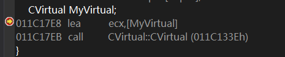

# 11.1 虚函数的机制
## 1. 虚表指针的初始化


图1

**如上图所示，对象`MyVirual`的定义处，编译器生成了调用构造函数的代码，但是`CVirual`并未定义任何构造函数，所以这是编译器提供的默认构造函数。 为什么在类中定义了虚函数，编译器就会添加默认构造函数？ 下面分析默认构造函数来找到原因：**

**`CVirual::CVirtual`关键代码：**
```
···
011C1700  mov         dword ptr [this],ecx  
011C1703  mov         eax,dword ptr [this]  
011C1706  mov         dword ptr [eax],11C6B34h  
011C170C  mov         eax,dword ptr [this]
···
```

**构造函数将地址值`11C6B34h`写入了对象开头的4字节处，这个地址就是虚表地址，虚表里保存了虚函数的入口地址(图2):**


图2

**在反汇编窗口输入`0x011C129E`和`0x011C11E5`，确实是`GetNumber`和`SetNumber`，如下图：**


图3


图4

**从以上分析可知，对象的虚表指针是通过编译器在构造函数内插入代码来完成的. 在程序员没有编写构造函数时，由于必须初始化虚表指针，编译器会提供默认构造函数，以完成虚表指针的初始化. 另外，对于任意一个自定义的构造函数，编译器也会插入初始化虚表指针的代码.**

## 2. 调用自身类的虚函数
### (1) 通过对象调用
**通过对象调用自身类的虚函数时，没有查虚表的操作，因为已经明确调用的是自身成员函数，根本没有构成多态性，查虚表只会画蛇添足，降低执行效率，所以这种情况处理为直接调用方式（图5）：**


图5

### (2) 通过对象指针（或引用）调用
**这种情况构成了多态性，需要查虚表(图6)：**


图6

## 3. 析构函数对虚表的操作
**直接修改前面的工程，添加一个非虚析构函数进行分析：**


图7

**析构函数将虚表指针设置成当前对象所属类中的虚表首地址，似乎和构造函数的操作一致，为窥探其中区别，有必要在一个继承关系中分析：**

```
class CBase {
public:
	virtual void Show() {
		printf("CBase\n");
	}
	~CBase() {
		printf("~CBase\n");
	}
};
class CChild :public CBase {
public:
	void Show() {
		printf("CChild\n");
	}
	~CChild() {
		printf("~CChild\n");
	}
};
void main() {
	CBase *pBase = new CChild;
	pBase->Show();
	delete pBase;
}
```

**结果输出：**

```
CChild
~CBase
```

**代码分析：**

```
	CBase *pBase = new CChild;
01154ADE  push        4  
01154AE0  call        operator new (011512C1h)  
01154AE5  add         esp,4  
01154AE8  mov         dword ptr [ebp-0D4h],eax  
01154AEE  cmp         dword ptr [ebp-0D4h],0  
01154AF5  je          main+4Ah (01154B0Ah)  
01154AF7  mov         ecx,dword ptr [ebp-0D4h]  
01154AFD  call        CChild::CChild (011513BBh)	; 调用子类构造函数  
01154B02  mov         dword ptr [ebp-0F4h],eax		; [ebp-0F4h] <- 子类对象的首址  
01154B08  jmp         main+54h (01154B14h)  
01154B0A  mov         dword ptr [ebp-0F4h],0  
01154B14  mov         eax,dword ptr [ebp-0F4h]  
01154B1A  mov         dword ptr [pBase],eax			; 基类指针`pBase`指向子类对象  
	pBase->Show();
01154B1D  mov         eax,dword ptr [pBase]  
01154B20  mov         edx,dword ptr [eax]			; edx <- 子类对象的虚表地址 
01154B22  mov         esi,esp  
01154B24  mov         ecx,dword ptr [pBase]  
01154B27  mov         eax,dword ptr [edx]			; eax <- 子类对象的虚表第一项（`CChild::Show`的入口地址）  
01154B29  call        eax							; call CChild::Show
```

**上述代码展示了虚函数是如何实现多态的，下面分析对象释放过程：**

```
	delete pBase;
01154B32  mov         eax,dword ptr [pBase]  
01154B35  mov         dword ptr [ebp-0ECh],eax  
01154B3B  mov         ecx,dword ptr [ebp-0ECh]  
01154B41  mov         dword ptr [ebp-0E0h],ecx  
01154B47  cmp         dword ptr [ebp-0E0h],0  
01154B4E  je          main+0A5h (01154B65h)  
01154B50  push        1							; 标记：释放单个对象(1)
01154B52  mov         ecx,dword ptr [ebp-0E0h]	; ecx <- 子类对象首址  
01154B58  call        CBase::`scalar deleting	; 析构代理函数 destructor' (0115142Eh)  
01154B5D  mov         dword ptr [ebp-0F4h],eax  
01154B63  jmp         main+0AFh (01154B6Fh)
```

**析构代理函数 CBase::`scalar deleting 内调用的是基类的析构函数：**

```
···
01151980  mov         dword ptr [this],ecx  
01151983  mov         ecx,dword ptr [this]  
01151986  call        CBase::~CBase (01151433h)
···
```

**`CBase::~CBase`中，向基类`CBase`的虚表指针写入的是其自身的虚表首地址，依然看不出有何意义. 所以下面将`CBase::~CBase`定义为虚函数，再次分析对象的释放过程：**

```
	delete pBase;
00F01B92  mov         eax,dword ptr [pBase]  
00F01B95  mov         dword ptr [ebp-0ECh],eax  
00F01B9B  mov         ecx,dword ptr [ebp-0ECh]		; ecx <- 子类对象首址  
00F01BA1  mov         dword ptr [ebp-0E0h],ecx  
00F01BA7  cmp         dword ptr [ebp-0E0h],0  
00F01BAE  je          main+0B6h (0F01BD6h)  
00F01BB0  mov         esi,esp  
00F01BB2  push        1								; 标记：释放单个对象(1) 
00F01BB4  mov         edx,dword ptr [ebp-0E0h]  
00F01BBA  mov         eax,dword ptr [edx]			; eax <- 子类对象的虚表地址  
00F01BBC  mov         ecx,dword ptr [ebp-0E0h]		; ecx <- 子类对象首址  
00F01BC2  mov         edx,dword ptr [eax+4]			; edx <- 子类对象的虚表的第2项  
00F01BC5  call        edx							; call CChild::~CChild
```

**与之前最大的不同之处在于，这里并未调用析构代理函数，而是通过虚表调用了子类对象的析构代理函数 CChild::`vector deleting destructor'（子类对象的虚表的第2项并不是`CChild::~CChild`的入口地址），并间接调用了`CChild::~CChild`.**

**`CChild::~CChild`关键代码：**

```
00F01980  mov         dword ptr [this],ecx			; this指针指向子类对象  
00F01983  mov         eax,dword ptr [this]
; 代码执行到此，子类的虚表指针和构造函数初始化的值一致
00F01986  mov         dword ptr [eax],0F07B54h		; 子类对象的虚表指针 <- 子类的虚表首址
		printf("~CChild\n");
00F0198C  push        0F07C88h  
00F01991  call        _printf (0F013D4h)  
00F01996  add         esp,4  
	}
; 将子类对象地址传入`ecx`，调用基类的析构函数
00F01999  mov         ecx,dword ptr [this]  
00F0199C  call        CBase::~CBase (0F0144Ch)
```

**跟踪`CBase::~CBase`时发现，this指针指向的是子类对象，所以虚表指针指向子类的虚表，但`CBase::~CBase`将虚表指针重写为自身类(即基类`CBase`)的虚表首址，如下图所示：**


图8

**综上，若基类定义了虚析构函数，编译器会在子类的析构函数结尾处插入调用基类析构函数的代码，使得子类和基类的析构函数被依次执行. 但不论如何，析构函数都会做一件事：让虚表指针指向自身的虚表首地址. 书中解释，“这是在还原虚表指针，让其指向自身的虚表首地址，防止在析构函数中调用虚函数时取到非自身虚表”，但是若在虚函数内调用自身类的虚函数，并不会查询虚表，所以“在析构函数中调用虚函数时取到非自身虚表”的隐患似乎并不存在，那么在虚函数中还原虚表指针的原因究竟是什么？**
