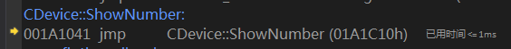
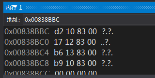
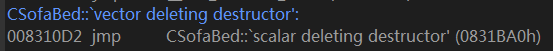
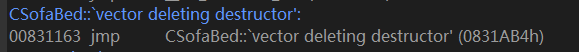

# 12.1 识别类和类之间的关系
## 1. 从内存角度看继承
**main()函数的主体如下：**


图1

**现在分析构造函数、成员函数和析构函数的调用细节.**

### (1) 构造函数


图2

**如上图所示，在执行子类`CDevice`构造函数中第一条自定义语句`printf("CDevice\n");`前，编译器插入了以指向子类对象`Device`的`this`指针为参数调用基类构造函数的代码.**

### (2) 成员函数
**下图展示了`CDevice::ShowNumber`调用`CBase::SetNumber`的情形：**


图3

**调用`CBase::SetNumber`时，this`指针指向子类对象`Device`，`CBase::SetNumber`返回后，`Device`的首4字节被修改--这4字节属于基类的私有数据成员`CBase::m_nNumber`，这说明在子类对象的内存结构中，基类的私有数据成员依然存在.**

**`m_nDevice = nNumber + 1`执行后，子类对象的内存被修改如下：**


图4

**事实上，在继承关系中，子类对象的内存结构 = 基类数据成员 + 子类数据成员，正如本例所显示的，类似于在子类中定义了父类对象作为数据成员.**

**在这样的内存结构下，不但可以使用指向子类对象的子类指针间接寻址到父类定义的成员，而且可以使用指向子类对象的父类指针间接寻址到父类定义的成员. 因此，在父类中，可以根据以上内存结构将子类对象的首址视为父类对象的首址来对数据进行操作（正如`CBase::SetNumber`的执行情况），而不会错位.**

**分析`CBase::SetNumber`的执行细节，可以发现：在调用基类成员函数时，虽然`this`指针传递的是子类对象的首址，但是在父类成员函数中可以成功寻址到父类中的数据. 再看之前提及的子类对象内存布局，基类数据成员在前，子类数据成员在后，结合`CBase::SetNumber`对基类数据的寻址，可见，这样的内存布局下，可以将子类指针当父类指针来使用；如果内存布局为“子类数据+父类数据”，对基类数据成员寻址时就必须将子类指针后移，令其指向父类对象，之后如果再访问子类数据成员，又要将指针前移--这无疑增加了执行的复杂程度.**

### (3) 析构函数
**第11章的笔记中已经分析过析构函数，此处从略.**

## 2. 第11章结尾处的疑问：为何构造函数要还原虚表指针？
**以下列代码进行分析：**

```
class CBase {
public:
	CBase() {
		printf("CBase - ");
		Show();
	}
	virtual ~CBase() {
		printf("~CBase - ");
		Show();
	}
	virtual void ShowNumber() {
		m_nNumber = 5;
		printf("CBase: %d\n", m_nNumber);
	}
public:
	int m_nNumber;
private:
	virtual void Show() {
		ShowNumber();
	}
};

class CDevice :public CBase {
public:
	CDevice() {}
	~CDevice() {}
	void ShowNumber() override {
		m_nDevice = 6;
		printf("CDevice: %d\n", m_nDevice);
	}
public:
	int m_nDevice;
};

void main() {
	CBase *pBase = new CDevice;
	pBase->ShowNumber();
	delete pBase;
}
```

**首先，构造函数将虚表指针设置为指向自身类的虚表，这是对虚表的初始化，分析过程从略. 现仅关注对象的释放与析构：**

### (1) 查询虚表，调用子类的析构代理函数：


图5

### (2) 跟踪析构代理函数，进入`CDevice::~CDevice`：


图6

**`CDevice::~CDevice`还原对象`Device`的虚表指针时，虚表指针亦指向`CDevice`的虚表，而后调用基类析构函数`CBase::~CBase`.**

### (3) `CBase::~CBase`还原虚表指针:


图7

**注意到调用`Show()`的方式，尽管`Show()`声明为虚函数，但此处没有查虚表，而是直接调用.**

### (4) `CBase::Show`


图8

**`CBase::Show()`内部调用虚函数`ShowNumber()`时查询虚表进行间接调用，由于此时对象`Device`的虚表指针已被`CBase::~CBase`还原为`CBase`类的虚表首址，因此调用到的是`CBase::ShowNumber`.**

**现在明白了，如果析构函数不还原虚表指针，那么`CBase::~CBase`调用`ShowNumber()`时将根据虚表调用到`CDevice::ShowNumber`，显然是不合理的，而且`CDevice`的析构函数已经执行过，不能确保`CDevice`类的虚表的可靠性. 下面通过内存窗体修改虚表指针，实现这个“不合理”的设计：**

**首先定位到`CBase::~CBase`还原虚表指针的代码，还原后在将他改回去：**


图9

**最后果然跳转到了`CDevice::ShowNumber`:**



图10

# 12.2 多重继承
## 1. 对象`CSofaBed`的构造过程
```
	CSofaBed SofaBed;
00831F60  lea         ecx,[SofaBed]  
00831F63  call        CSofaBed::CSofaBed (083107Dh)  
00831F68  mov         dword ptr [ebp-4],0  
```
**定义对象`SofaBed`时，传递`this`指针，调用构造函数`CSofaBed::CSofaBed()`.**

**`CSofaBed::CSofaBed()`关键代码分析：**


图11

### (1) 调用父类`CSofa`的构造函数.
### (2) 根据`CSofa`占据的内存空间(`CSofa`的大小为8字节=4字节虚表指针+4字节int类型成员变量`CSofa::m_nColor`)调整`this`指针，调用父类`CBed`的构造函数.
### (3) 初始化虚表指针
**查看`0x00838BBC`和`0x00838BD4`处的内存：**



图12

**对应的虚函数如下:**




----------


图13

**对应的虚函数如下:**




----------

**注意到父类`CSofa`除了析构函数外还有2个虚函数: `CSofa::GetColor`和`CSofa::SitDown`，其中`CSofa::SitDown`被子类重写；父类`CBed`除了析构函数外还有2个虚函数：`CBed::GetArea`和`CBed::Sleep`，其中`CBed::Sleep`被子类重写; 子类自己定义了虚函数`CSofaBed::GetHight`.**

**显然，由于有两个父类，因此子类拥有两份虚函数表，以及与父类们对应的虚表指针.**

## 2. 多重继承子类对象转换为父类指针
```
	CSofaBed SofaBed;
00831F60  lea         ecx,[SofaBed]  
00831F63  call        CSofaBed::CSofaBed (083107Dh)  
00831F68  mov         dword ptr [ebp-4],0  
	CSofa *pSofa = &SofaBed;
00831F6F  lea         eax,[SofaBed]  
00831F72  mov         dword ptr [pSofa],eax  
	CBed *pBed = &SofaBed;
00831F75  lea         eax,[SofaBed]  
00831F78  test        eax,eax  
00831F7A  je          main+6Ah (0831F8Ah)  
00831F7C  lea         ecx,[SofaBed]  
00831F7F  add         ecx,8  
00831F82  mov         dword ptr [ebp-10Ch],ecx  
00831F88  jmp         main+74h (0831F94h)  
00831F8A  mov         dword ptr [ebp-10Ch],0  
00831F94  mov         edx,dword ptr [ebp-10Ch]  
00831F9A  mov         dword ptr [pBed],edx  
```

**在转换`CBed`指针时，会调整首地址并跳过第一个父类所占用的空间(`add ecx,8`)。这样一来，当使用父类`CBed`指针访问`CBed`中实现的虚函数时，就不会错误地寻址到继承自`CSofa`类的成员变量.**

## 3. 多重继承的类对象析构函数
**根据子类对象首地址调用父类析构函数时，依然会调整`this`指针，就不再附代码了.**